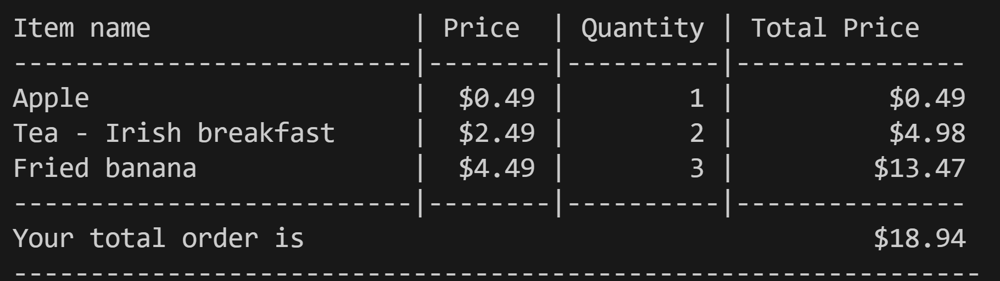

#python-challenge-1
# Module 2 Challenge

## Interactive Food Truck Menu

### Description
The application is desgined to offer an interctive food truck menu for userto place order by selecting menu category and selecting item from each category. Once user decides to stop ordering, screen shows user what is ordered, cost for each item and quantity ordered. The application calculates total cost of all items ordered. 

## Application
The food truck menu has two sections
1. Menu options
2. Menu items

### Menu options
* Category of types of food that can be ordered 
* Each menu option is identified by number for ease of selection
* User is promoted to select a menu number 
    > Type menu number 
    
* If user types number other than that on the menu, user is alterted 
    > Your input is invalid. Please select a number from the menu
* After doing appropriate selection, user is shown name of menu option selected. 
* Based on menu option selected, user is shown respective menu items with prices to place an order 
---
### Menu items
* Each menu item is numbered to make it easy to select
* User is prompted to type menu number
    > Type item number to order
* Once user selects menu number, user is shown name of the menu item cooresponding to selected number
* User is now prompted to enter quantity.If user does not enter a value or enters non integrer, value is defaulted to 1 
    > How many of selected item do you want to order?

* After quantity is entered, user is given a choice to keep ordering 
    > Would you like to keep ordering? (Y)es or (N)o.

    * Care is taken to capitalize the response should user type y instead of Y

* If user decides to continue ordering, user is looped back to menu options
* If user decides stop ordering, user is thanked for the order.
    > Thank you. Preparing your order.

    > This is what we are preparing for you.  
* A formatted list of item(s), price and quantity are displayed for each ordered items.
    * User is shown total ordered amount.
    

## Cencepts learnt

In this application, I learnt how to
* Prompting user for a questions
* Validate and handle user response by converting to upper or lower case
* Create list and dictionary
* Use if elif else loop
* Code refactoring
* Use Match-Case instead of if elif else command 
* While and for loop
* Nested loops
* Store variables in data structures viz. dictionaries and lists
* Do calculations for a list
* Iterate through data structures 

